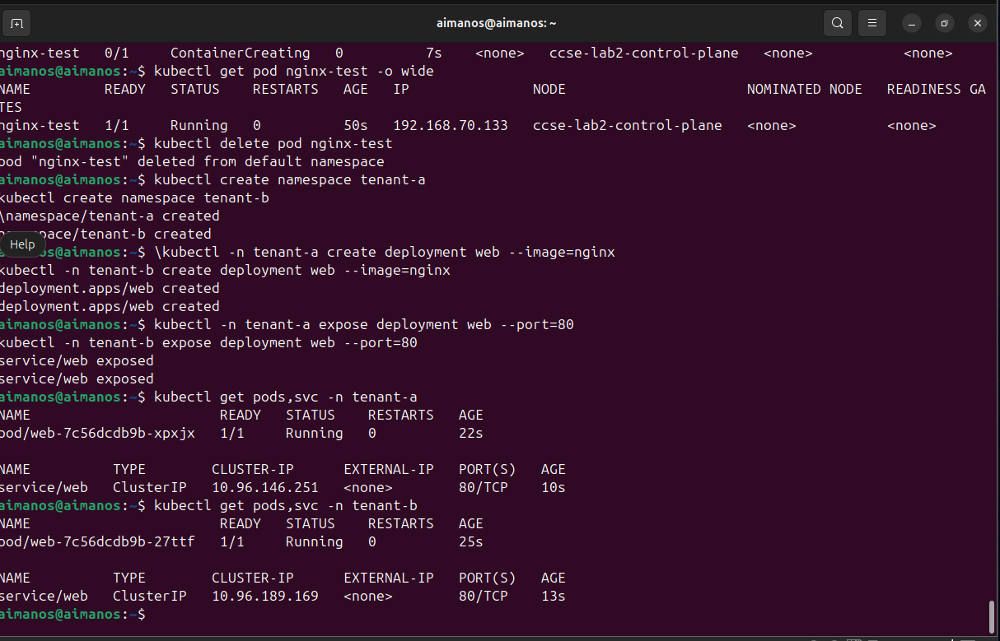
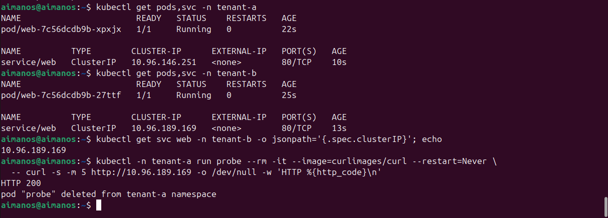
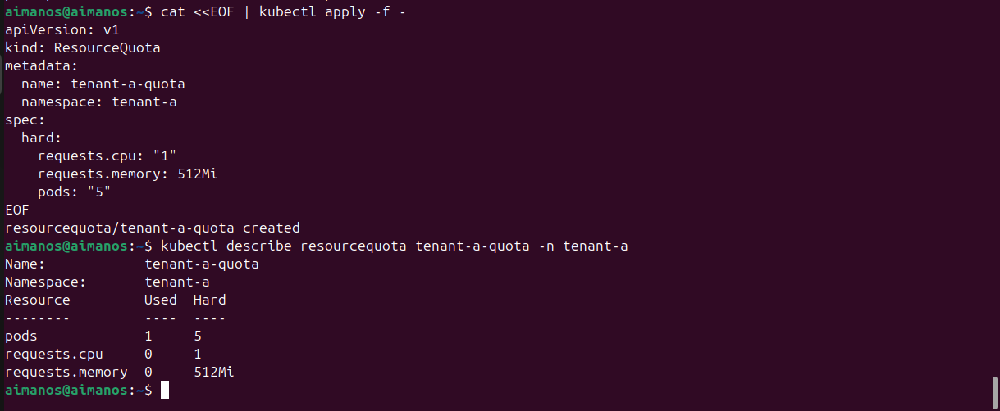
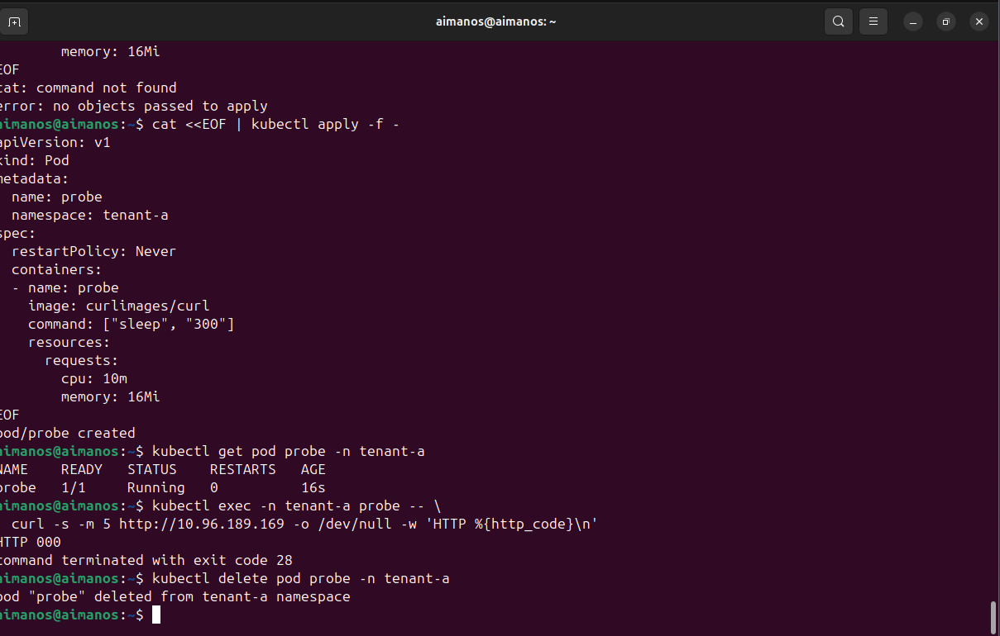
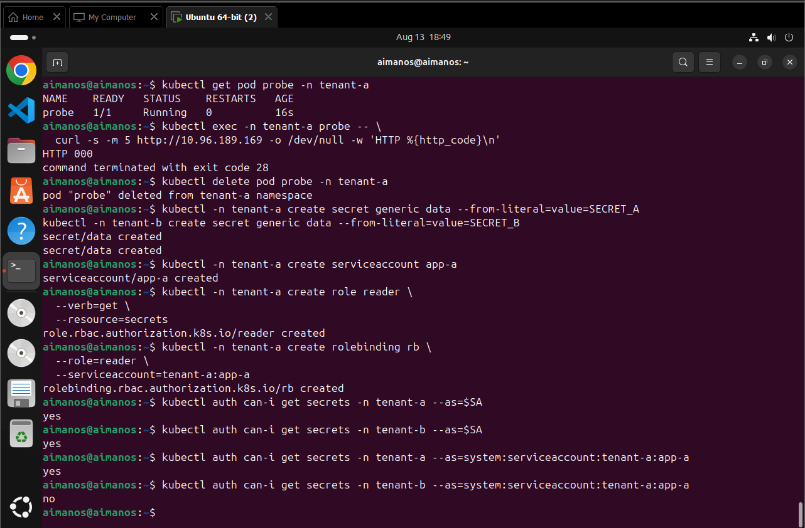
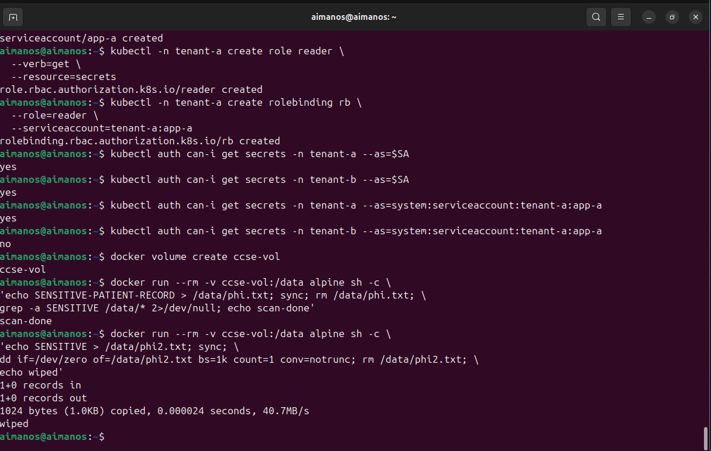

# Environment Setup Report

## Lab Title

**IKB42603 Lab 2: Secure Isolation and Multitenancy**

## Course Information

- Course: IKB42603 Cloud Computing Security Essentials
- Lab: 2
- Name: Muhammad Aiman
- No. ID: 52215124380
- Date: 13/8/2026

## Objective

This report documents the environment setup and validation steps for secure isolation and multitenancy in a Kubernetes environment. The lab demonstrates namespace-based tenant separation, default Kubernetes network behavior, resource quota enforcement, network policy isolation, secret access control, and data remanence handling.

The main objective of this lab is to understand how a shared cloud-native platform can safely host workloads from different tenants. In a multitenant environment, several users, teams, departments, or customers may use the same underlying infrastructure. Without proper isolation controls, one tenant may accidentally or intentionally access another tenant's workload, consume too many shared resources, read sensitive information, or leave confidential data behind after deletion. This lab uses Kubernetes and Docker to demonstrate these risks and the controls that can reduce them.

The report also records the practical commands used during the lab, the observed output, and the security meaning of each result. Each screenshot evidence file supports one major part of the lab activity.

## Executive Summary

This lab successfully demonstrated secure isolation and multitenancy concepts in a Kubernetes environment. Two namespaces, `tenant-a` and `tenant-b`, were created to represent separate tenants. Each tenant was given its own web application and service. The initial network test showed that Kubernetes allowed cross-namespace communication by default, as `tenant-a` was able to access the `tenant-b` web service and receive an `HTTP 200` response.

After the baseline test, isolation controls were applied and tested. A ResourceQuota was configured for `tenant-a` to limit resource usage. A network isolation test later showed that traffic from `tenant-a` to the `tenant-b` service was blocked, resulting in `HTTP 000` and a timeout. RBAC was also tested by creating tenant-specific secrets and assigning a service account permission to read secrets only in its own namespace. The result showed that the service account could access secrets in `tenant-a` but was denied access to secrets in `tenant-b`.

The final part of the lab focused on data remanence. Docker volume testing was used to show that sensitive data requires careful cleanup. The lab demonstrated a safer approach by overwriting data before deleting it. Overall, the lab confirmed that namespace separation alone is not enough for secure multitenancy. Effective multitenancy requires network policies, resource limits, RBAC, and secure data handling.

## Scope of Work

The scope of this report includes:

- Creating Kubernetes namespaces for two tenants.
- Deploying and exposing tenant workloads.
- Testing default cross-tenant network access.
- Applying and verifying resource quota limits.
- Testing network isolation after default deny behavior.
- Creating secrets in separate tenant namespaces.
- Testing RBAC permissions using a tenant service account.
- Creating and testing a Docker volume for data remanence behavior.
- Demonstrating overwrite-before-delete as a safer cleanup method.

The report focuses on the lab environment and evidence provided in the workspace. It does not include production-level hardening steps such as admission controllers, pod security standards, encryption provider configuration, audit logging, or external identity integration.

## Background

Multitenancy is a common cloud computing model where multiple tenants share the same physical or virtual infrastructure. In Kubernetes, this is commonly implemented using namespaces, RBAC, NetworkPolicy, quotas, and other policy controls. A namespace provides logical separation for resources, but it does not automatically provide complete security isolation.

Secure isolation means ensuring that one tenant cannot interfere with another tenant's workloads, data, secrets, or resource availability. A strong multitenant design should address several security areas:

- **Workload isolation:** Tenant workloads should be separated using namespaces or stronger boundaries.
- **Network isolation:** Tenant pods should not freely communicate with other tenants unless explicitly allowed.
- **Resource isolation:** One tenant should not be able to consume excessive CPU, memory, or pod capacity.
- **Identity and access isolation:** Service accounts and users should only have the permissions they need.
- **Data isolation:** Sensitive data should not remain accessible after a tenant deletes files or releases storage.

This lab demonstrates these areas using small but practical examples.

## Environment

- Platform: Ubuntu 64-bit virtual machine
- Container runtime: Docker
- Orchestration platform: Kubernetes
- Command-line tools used: `kubectl`, `docker`, `curl`
- Tenants created: `tenant-a` and `tenant-b`

The environment appears to run inside an Ubuntu virtual machine. Kubernetes commands were executed through a terminal session using `kubectl`. Docker was used during the data remanence section to create and mount a named volume. The workload image used for the tenant applications was `nginx`, while the test client image used for network verification was `curlimages/curl`.

The lab environment is suitable for demonstrating security concepts because it allows direct inspection of pods, services, namespaces, resource quotas, RBAC permissions, and Docker volume behavior.

## Evidence Files

The following screenshots were used as evidence:

- `Task_1_Two_Tenants.png`
- `Task_2_Default_Open_HTTP_200.png`
- `Task_3_Resource_Quota.png`
- `Task_4_Default_Deny_Timeout.png`
- `Task_5_Secret_Isolation.png`
- `Task_6_Data_Remanence.png`

These evidence files show the terminal output for each major task. They are included throughout the report to connect the written explanation with the actual lab results.

## Methodology

The lab was completed using a practical validation approach. First, the environment was configured by creating namespaces and workloads. Next, the default behavior of the platform was tested before applying isolation controls. This is important because a secure design should be compared against the original insecure or less restrictive state.

After establishing the baseline, specific controls were applied and verified. The ResourceQuota test verified resource limits. The network isolation test verified traffic blocking. The RBAC test verified access control for secrets. The data remanence test verified the risk of leaving sensitive data behind in storage.

For each task, the following method was used:

- Run the command or apply the configuration.
- Observe the terminal output.
- Compare the output against the expected behavior.
- Interpret the result from a cloud security perspective.
- Capture the result as evidence.

## Step 1: Prepare Two Tenant Namespaces

### Purpose

The first step creates two isolated Kubernetes namespaces to represent two separate tenants.

Namespaces are a basic Kubernetes mechanism for grouping and separating resources. In this lab, `tenant-a` and `tenant-b` represent two different tenants using the same cluster. Creating separate namespaces makes it easier to apply policies, quotas, roles, and permissions to each tenant independently.

Although namespaces are useful, they should not be misunderstood as complete security boundaries by themselves. A namespace separates object names and provides a target for policies, but additional controls are required to prevent unwanted network communication, resource abuse, and unauthorized access.

### Commands

```bash
kubectl create namespace tenant-a
kubectl create namespace tenant-b
```

### Result

Both namespaces were created successfully:

```text
namespace/tenant-a created
namespace/tenant-b created
```

### Security Interpretation

The result confirms that the cluster now has two logical tenant environments. This is the foundation for the rest of the lab because later security controls are applied at the namespace level. The namespaces allow the administrator to manage tenant workloads separately and reduce accidental mixing of resources.

At this point, however, no strong security policy has been applied yet. The namespaces exist, but network access and permissions still need to be tested and restricted.

## Step 2: Deploy Web Applications for Each Tenant

### Purpose

Each tenant was given its own `nginx` web deployment to simulate tenant workloads running in the same Kubernetes cluster.

The `nginx` image was used because it provides a simple web server that can respond to HTTP requests. This makes it easy to test whether traffic can pass between tenants. Each deployment is named `web`, but because they are created in different namespaces, Kubernetes treats them as separate resources.

### Commands

```bash
kubectl -n tenant-a create deployment web --image=nginx
kubectl -n tenant-b create deployment web --image=nginx
```

### Result

The `web` deployment was created in both namespaces:

```text
deployment.apps/web created
deployment.apps/web created
```

### Security Interpretation

This step confirms that two tenants can run similar workloads at the same time inside the shared cluster. The workloads are logically separated by namespace, even though they use the same deployment name and image.

From a cloud security perspective, this reflects a common multitenant scenario. Different tenants may run identical applications, but each tenant should only be able to manage and access its own resources unless explicit sharing is allowed.

## Step 3: Expose the Web Deployments

### Purpose

Each web deployment was exposed through a Kubernetes `ClusterIP` service on port `80`.

A Kubernetes service provides a stable virtual IP address for accessing pods. Pods can be recreated and receive different pod IP addresses, but the service IP remains stable. In this lab, exposing each deployment allows the tenant workloads to be tested using HTTP.

The `ClusterIP` service type is only reachable inside the cluster. It is useful for internal service-to-service communication and is suitable for this lab because the test focuses on communication between pods inside Kubernetes.

### Commands

```bash
kubectl -n tenant-a expose deployment web --port=80
kubectl -n tenant-b expose deployment web --port=80
```

### Result

The services were created successfully:

```text
service/web exposed
service/web exposed
```

The service and pod status were then checked:

```bash
kubectl get pods,svc -n tenant-a
kubectl get pods,svc -n tenant-b
```

Observed service IP addresses:

- `tenant-a` service IP: `10.96.146.251`
- `tenant-b` service IP: `10.96.189.169`

Both tenant pods were running and both services were available on `80/TCP`.

### Expected Behavior

The expected result was that each tenant would have:

- One running `web` pod.
- One `ClusterIP` service named `web`.
- A service port of `80/TCP`.

### Observed Behavior

The screenshots show that both tenant services were created successfully. `tenant-a` received the service IP `10.96.146.251`, while `tenant-b` received the service IP `10.96.189.169`. Both pods were in the `Running` state and ready with `1/1` containers.

### Security Interpretation

The environment is now ready for testing cross-tenant access. Since the services are reachable inside the cluster, a pod in one namespace can be used to test whether another namespace's service is accessible. This is a key test because secure multitenancy should prevent unnecessary tenant-to-tenant communication.

### Evidence



## Step 4: Verify Default Open Network Access

### Purpose

This step verifies the default Kubernetes behavior before applying network isolation. By default, pods in different namespaces can often communicate unless a `NetworkPolicy` blocks the traffic.

This is an important baseline test. Before security controls are applied, the lab checks whether a pod from `tenant-a` can access the service running in `tenant-b`. If access is successful, it proves that namespace separation alone does not automatically block network traffic.

In real cloud environments, default open communication can become a security risk. If one tenant's workload is compromised, an attacker may try to scan or access services belonging to another tenant. Network isolation helps reduce this risk by applying a default deny approach and only allowing approved traffic.

### Commands

The service IP for `tenant-b` was retrieved:

```bash
kubectl get svc web -n tenant-b -o jsonpath='{.spec.clusterIP}'; echo
```

Then a temporary curl pod was run from `tenant-a` to access the `tenant-b` web service:

```bash
kubectl -n tenant-a run probe --rm -i -t --image=curlimages/curl --restart=Never \
  -- curl -s -m 5 http://10.96.189.169 -o /dev/null -w 'HTTP %{http_code}\n'
```

### Result

The request returned:

```text
HTTP 200
```

This confirms that before applying network policies, `tenant-a` could reach the `tenant-b` service.

### Expected Behavior

Before applying isolation, the expected behavior was that the curl request from `tenant-a` would be able to reach the `tenant-b` service. The expected HTTP status was `200`, which means the web server responded successfully.

### Observed Behavior

The screenshot shows that the `tenant-b` service IP was `10.96.189.169`. A temporary curl pod was launched from `tenant-a`, and the HTTP request returned:

```text
HTTP 200
```

The temporary pod was then removed automatically after the test.

### Security Interpretation

This result proves that Kubernetes namespaces alone did not block cross-tenant network communication. Even though `tenant-a` and `tenant-b` are separate namespaces, a pod from `tenant-a` could still reach the `tenant-b` service.

This is a useful finding because it shows why NetworkPolicy is necessary in multitenant Kubernetes environments. Without network restrictions, a tenant may be able to access internal services belonging to another tenant. In secure designs, administrators normally start with default deny policies and then create allow rules only for required communication.

### Evidence



## Step 5: Apply Resource Quota to Tenant A

### Purpose

Resource isolation prevents one tenant from exhausting shared cluster resources and affecting other tenants. A `ResourceQuota` was applied to `tenant-a`.

Resource isolation is important in multitenancy because all tenants share the same underlying cluster capacity. If one tenant creates too many pods or requests too much CPU and memory, other tenants may experience reduced performance or failed deployments. This type of issue can happen accidentally due to misconfiguration, or intentionally as a denial-of-service attempt.

The ResourceQuota object limits how many resources a namespace can consume. In this lab, the quota limits the number of pods and the total requested CPU and memory for `tenant-a`.

### Manifest

```yaml
apiVersion: v1
kind: ResourceQuota
metadata:
  name: tenant-a-quota
  namespace: tenant-a
spec:
  hard:
    requests.cpu: "1"
    requests.memory: 512Mi
    pods: "5"
```

### Command

```bash
kubectl apply -f -
```

### Verification Command

```bash
kubectl describe resourcequota tenant-a-quota -n tenant-a
```

### Result

The quota was created successfully:

```text
resourcequota/tenant-a-quota created
```

The quota limits shown were:

```text
pods              Used: 1   Hard: 5
requests.cpu      Used: 0   Hard: 1
requests.memory   Used: 0   Hard: 512Mi
```

This confirms that `tenant-a` now has a limit of 5 pods, 1 requested CPU core, and 512 MiB requested memory.

### Expected Behavior

The expected result was that Kubernetes would accept the ResourceQuota manifest and enforce the following hard limits for `tenant-a`:

- Maximum pods: `5`
- Maximum requested CPU: `1`
- Maximum requested memory: `512Mi`

### Observed Behavior

The quota was created successfully and `kubectl describe resourcequota` showed the configured limits. The output also showed that `tenant-a` was currently using 1 pod out of the allowed 5 pods.

### Security Interpretation

The ResourceQuota improves tenant isolation by limiting resource consumption at the namespace level. This prevents `tenant-a` from creating unlimited pods or reserving excessive CPU and memory. In a production environment, similar quotas would normally be configured for every tenant namespace.

This control supports availability, which is one of the main goals of cloud security. Even if a tenant makes a mistake or runs a workload that scales too aggressively, quotas help protect the shared cluster and other tenants from resource exhaustion.

### Limitation

ResourceQuota does not secure network access or secret access. It only controls resource consumption. Therefore, it must be combined with other controls such as NetworkPolicy and RBAC.

### Evidence



## Step 6: Apply Default Deny Network Isolation

### Purpose

After proving that cross-tenant access was open by default, this step validates network isolation by blocking access from `tenant-a` to the `tenant-b` service.

The earlier baseline test showed that `tenant-a` could reach `tenant-b`. This step tests the protected state after isolation controls are applied. A temporary probe pod is created inside `tenant-a` and used to make an HTTP request to the `tenant-b` service IP.

The expected secure behavior is that the connection should fail or time out. A timeout is a strong indication that traffic is being blocked before it reaches the target web service.

### Test Pod Manifest

A temporary probe pod was created in `tenant-a` using the `curlimages/curl` image:

```yaml
apiVersion: v1
kind: Pod
metadata:
  name: probe
  namespace: tenant-a
spec:
  restartPolicy: Never
  containers:
  - name: probe
    image: curlimages/curl
    command: ["sleep", "300"]
    resources:
      requests:
        cpu: 10m
        memory: 16Mi
```

### Verification Commands

```bash
kubectl get pod probe -n tenant-a
kubectl exec -n tenant-a probe -- \
  curl -s -m 5 http://10.96.189.169 -o /dev/null -w 'HTTP %{http_code}\n'
kubectl delete pod probe -n tenant-a
```

### Result

The probe pod was running, but the connection to `tenant-b` timed out:

```text
HTTP 000
command terminated with exit code 28
```

This confirms that after isolation was applied, `tenant-a` could no longer access the `tenant-b` service.

### Expected Behavior

After default deny isolation, a pod in `tenant-a` should not be able to connect to the `tenant-b` web service unless a specific allow rule exists. The expected result was a timeout or failed request.

### Observed Behavior

The probe pod was created successfully in `tenant-a` and reached the `Running` state. When the curl command attempted to connect to `10.96.189.169`, the result was:

```text
HTTP 000
command terminated with exit code 28
```

In curl, exit code `28` commonly means the operation timed out. `HTTP 000` means no valid HTTP response was received.

### Security Interpretation

This result confirms that network isolation was effective. Unlike the earlier test where the request returned `HTTP 200`, the protected test timed out. This before-and-after comparison clearly demonstrates the value of network policy controls in Kubernetes.

For a multitenant system, this is one of the most important protections. Tenant workloads should not be able to freely communicate with other tenant workloads. A default deny approach reduces the attack surface and limits lateral movement if one workload is compromised.

### Operational Note

The evidence screenshot shows an earlier command mistake before the corrected probe pod command was applied. The final successful test result is the important part of the evidence: the probe pod ran and the connection to `tenant-b` timed out.

### Evidence



## Step 7: Validate Secret Isolation with RBAC

### Purpose

This step verifies that Kubernetes secrets are isolated by namespace and that access can be restricted using RBAC.

Secrets are used to store sensitive information such as passwords, tokens, keys, and connection strings. In a multitenant cluster, it is critical that one tenant cannot read another tenant's secrets. If secret isolation fails, a tenant may be able to steal credentials and access systems outside its own boundary.

Kubernetes uses RBAC to control what users and service accounts can do. In this task, a service account named `app-a` was created in `tenant-a`. A role named `reader` was created in the same namespace to allow the `get` action on secrets. The role was then bound to the `app-a` service account using a role binding.

### Commands

Secrets were created in both tenant namespaces:

```bash
kubectl -n tenant-a create secret generic data --from-literal=value=SECRET_A
kubectl -n tenant-b create secret generic data --from-literal=value=SECRET_B
```

A service account was created for `tenant-a`:

```bash
kubectl -n tenant-a create serviceaccount app-a
```

A role was created to allow reading secrets only in `tenant-a`:

```bash
kubectl -n tenant-a create role reader \
  --verb=get \
  --resource=secrets
```

The role was bound to the `tenant-a` service account:

```bash
kubectl -n tenant-a create rolebinding rb \
  --role=reader \
  --serviceaccount=tenant-a:app-a
```

### Verification Commands

```bash
kubectl auth can-i get secrets -n tenant-a --as=system:serviceaccount:tenant-a:app-a
kubectl auth can-i get secrets -n tenant-b --as=system:serviceaccount:tenant-a:app-a
```

### Result

The service account could access secrets in its own namespace:

```text
yes
```

The same service account could not access secrets in the other tenant namespace:

```text
no
```

This confirms that RBAC limited the `tenant-a` service account to secret access within `tenant-a` only.

### Expected Behavior

The expected result was:

- `tenant-a:app-a` should be able to get secrets in `tenant-a`.
- `tenant-a:app-a` should not be able to get secrets in `tenant-b`.

This behavior follows the principle of least privilege, where an identity receives only the permissions needed for its own namespace.

### Observed Behavior

The screenshots show that secrets were created in both namespaces:

```text
secret/data created
secret/data created
```

The `app-a` service account, `reader` role, and `rb` role binding were also created successfully. The final authorization checks showed:

```text
yes
no
```

The first `yes` means the service account could read secrets in `tenant-a`. The `no` means the same service account could not read secrets in `tenant-b`.

### Security Interpretation

The RBAC test successfully demonstrated identity and access isolation. Even though both tenants are in the same cluster and both have a secret named `data`, the service account from `tenant-a` was only authorized in its own namespace.

This is a strong security result because it shows that namespace-scoped RBAC can prevent cross-tenant secret access. In production, administrators should avoid giving broad cluster-wide permissions unless absolutely necessary. They should also regularly review role bindings to ensure service accounts do not have excessive access.

### Important Observation

The screenshot also includes two checks using the shell variable `$SA`, which returned `yes` for both namespaces. The later explicit checks using the full service account identity are more reliable because they clearly specify:

```text
system:serviceaccount:tenant-a:app-a
```

Those explicit checks are the main evidence for the RBAC result.

### Evidence



## Step 8: Validate Data Remanence Risk

### Purpose

Data remanence occurs when deleted sensitive data remains recoverable from storage. This step demonstrates why simple file deletion is not always enough.

In cloud environments, storage is often reused. Containers, volumes, disks, and snapshots may be created, deleted, and attached to different workloads over time. If sensitive data is not properly removed, traces of that data may remain in storage. This can create privacy, compliance, and security risks.

The lab uses a Docker named volume called `ccse-vol` to simulate persistent storage. A file containing sensitive text is written to the volume, synchronized to disk, deleted, and then the volume is scanned.

### Commands

A Docker volume was created:

```bash
docker volume create ccse-vol
```

Sensitive data was written to a file, deleted, and then the volume was scanned:

```bash
docker run --rm -v ccse-vol:/data alpine sh -c \
  'echo SENSITIVE-PATIENT-RECORD > /data/phi.txt; sync; rm /data/phi.txt; \
  grep -a SENSITIVE /data/* 2>/dev/null; echo scan-done'
```

### Result

The scan completed:

```text
scan-done
```

This step demonstrates that data deletion must be handled carefully because sensitive data can remain in storage layers or reusable volumes depending on how the storage is managed.

### Expected Behavior

The purpose of this test was to show the risk of relying only on normal file deletion. The file was removed using `rm`, but deletion normally removes the directory reference to a file rather than guaranteeing that the old content has been overwritten at the storage level.

### Observed Behavior

The Docker volume `ccse-vol` was created successfully. The command wrote `SENSITIVE-PATIENT-RECORD` to `/data/phi.txt`, synchronized the write, deleted the file, and completed the scan with:

```text
scan-done
```

### Security Interpretation

This task highlights that deletion and secure erasure are different concepts. A normal delete operation may make a file unavailable through the filesystem, but it does not always guarantee that the underlying data blocks are immediately overwritten. In environments handling sensitive data, such as patient records, financial data, or credentials, secure disposal procedures are important.

For cloud security, data remanence is especially important because storage may be reused by new workloads. Cloud providers and platform administrators must ensure that deleted tenant data cannot be recovered by another tenant.

## Step 9: Wipe Sensitive Data Before Deletion

### Purpose

This step applies a safer cleanup method by overwriting the sensitive file before removing it.

The safer approach demonstrated in this step is overwrite-before-delete. Instead of only deleting the file, the file content is overwritten with zero bytes using `dd`. After the overwrite completes, the file is removed. This reduces the chance that the original sensitive content remains recoverable from the same file location.

### Command

```bash
docker run --rm -v ccse-vol:/data alpine sh -c \
  'echo SENSITIVE > /data/phi2.txt; sync; \
  dd if=/dev/zero of=/data/phi2.txt bs=1K count=1 conv=notrunc; rm /data/phi2.txt; \
  echo wiped'
```

### Result

The overwrite command completed successfully:

```text
1+0 records in
1+0 records out
1024 bytes (1.0KB) copied
wiped
```

This confirms that the file content was overwritten before deletion.

### Expected Behavior

The expected result was that `dd` would overwrite the sensitive file with zero bytes and then the file would be removed. The command should display the number of records written and print `wiped` at the end.

### Observed Behavior

The output showed:

```text
1+0 records in
1+0 records out
1024 bytes (1.0KB) copied
wiped
```

This means 1 KiB of zero bytes was written to the file before deletion.

### Security Interpretation

The overwrite step is safer than a normal delete because it changes the file content before removing the file reference. This reduces the risk of recovering the original sensitive value from the same storage location.

However, it is important to note that secure deletion can be complex on modern storage systems. Filesystems, copy-on-write layers, SSD wear leveling, snapshots, and backups may still retain older copies. In production cloud environments, secure data disposal should also include encryption at rest, key destruction, storage lifecycle policies, snapshot management, and provider-level media sanitization controls.

### Evidence



## Summary of Findings

| Area | Finding |
| --- | --- |
| Namespace isolation | `tenant-a` and `tenant-b` were created as separate Kubernetes namespaces. |
| Workload separation | Each tenant ran its own `nginx` deployment and `ClusterIP` service. |
| Default network access | `tenant-a` could reach `tenant-b` before network isolation, returning `HTTP 200`. |
| Resource isolation | `tenant-a` was limited to 5 pods, 1 CPU request, and 512 MiB memory request. |
| Network isolation | After default deny isolation, access from `tenant-a` to `tenant-b` timed out with `HTTP 000`. |
| Secret isolation | `tenant-a:app-a` could read secrets in `tenant-a` but not in `tenant-b`. |
| Data remanence | Sensitive data handling was tested and a wipe-before-delete method was demonstrated. |

## Discussion

This lab shows that secure multitenancy requires several layers of control. The first layer is namespace separation. Namespaces help organize workloads and make it possible to apply policies to each tenant separately. However, the lab also showed that namespaces alone are not enough. The default network test returned `HTTP 200`, proving that a workload from one namespace could reach a workload in another namespace before network isolation was applied.

The ResourceQuota section demonstrated availability protection. In cloud security, availability is just as important as confidentiality and integrity. If a tenant can create unlimited pods or reserve unlimited CPU and memory, the cluster can become unstable or unavailable for other tenants. By setting a quota, the administrator reduces the risk of resource exhaustion.

The network isolation section demonstrated the importance of default deny behavior. After isolation was applied, the same cross-tenant connection that previously succeeded now timed out. This is a practical example of reducing lateral movement. If an attacker compromises one pod, network policies can limit what the attacker can reach next.

The RBAC section demonstrated least privilege. The service account `tenant-a:app-a` was allowed to read secrets only inside `tenant-a`. It was denied when trying to read secrets in `tenant-b`. This is important because service accounts are commonly used by applications running inside pods. If those accounts are over-permissioned, an application compromise can quickly become a cluster-wide security incident.

The data remanence section demonstrated that storage cleanup must be treated carefully. Removing a file does not always mean the data is securely erased. For sensitive records, deletion should be combined with secure handling practices such as overwriting, encryption, and key destruction.

## Security Principles Demonstrated

| Security Principle | How It Was Demonstrated |
| --- | --- |
| Least privilege | The `app-a` service account was only allowed to read secrets in `tenant-a`. |
| Defense in depth | The lab combined namespaces, quotas, network isolation, RBAC, and storage cleanup. |
| Default deny | Cross-tenant traffic was blocked after isolation was applied. |
| Resource fairness | ResourceQuota limited how much `tenant-a` could consume. |
| Confidentiality | Secret access was restricted between tenant namespaces. |
| Availability | Quotas helped prevent one tenant from exhausting shared resources. |
| Secure disposal | Sensitive data was overwritten before deletion. |

## Challenges and Observations

During the lab, one command sequence shown in the Task 4 evidence had an error before the corrected command was applied. This is a normal part of hands-on lab work, especially when using heredoc input in a terminal. The important point is that the corrected pod manifest was successfully applied and the final test result showed the intended timeout.

Another observation is that the early RBAC checks using `$SA` returned `yes` for both namespaces. This may happen if the variable was not set as expected or if the command did not represent the intended service account identity. The later checks using the full identity `system:serviceaccount:tenant-a:app-a` are clearer and show the correct security behavior: access was allowed in `tenant-a` and denied in `tenant-b`.

The lab also highlights that evidence screenshots are useful for proving the practical result of each step. The screenshots show not only the commands but also the outputs, which makes it easier to verify that the environment behaved as expected.

## Recommendations

Based on the lab results, the following recommendations are suggested for secure Kubernetes multitenancy:

- Use separate namespaces for each tenant.
- Apply ResourceQuota to every tenant namespace.
- Apply LimitRange policies so pods have default CPU and memory requests.
- Use NetworkPolicy with a default deny model.
- Only allow required traffic between namespaces.
- Use namespace-scoped roles instead of broad cluster roles whenever possible.
- Avoid granting service accounts access to secrets outside their own namespace.
- Regularly review role bindings and service account permissions.
- Use encryption at rest for secrets and persistent volumes.
- Securely wipe or encrypt sensitive data before releasing storage.
- Avoid storing sensitive data in temporary files unless necessary.
- Maintain audit logs for access to secrets and administrative actions.

## Limitations

This lab was performed in a controlled learning environment. The results demonstrate the concepts clearly, but a production environment would require additional security controls. For example, production clusters should include admission control policies, pod security standards, image scanning, logging, monitoring, encryption configuration, backup protection, and incident response procedures.

The data remanence demonstration also uses a simplified Docker volume example. Real-world storage systems may behave differently depending on filesystem type, storage driver, snapshots, backup systems, SSD behavior, and cloud provider implementation.

## Lessons Learned

The main lesson from this lab is that multitenancy is not achieved by one control only. Creating namespaces is only the starting point. A secure environment requires multiple controls working together.

The lab also shows the value of testing security assumptions. It may be easy to assume that separate namespaces automatically block communication, but the `HTTP 200` result proved that this assumption was incorrect. Security controls should always be verified through practical testing.

Another lesson is that identity must be carefully scoped. Service accounts are powerful because applications use them to interact with the Kubernetes API. If they are given too many permissions, attackers may use them to access secrets or modify resources. RBAC should therefore follow the principle of least privilege.

Finally, secure data handling must include the full lifecycle of information. Sensitive data must be protected when created, stored, accessed, transmitted, deleted, and disposed of. Data remanence is a reminder that deletion alone may not be enough for confidential information.

## Conclusion

The lab environment was successfully configured to demonstrate secure isolation and multitenancy concepts. Kubernetes namespaces separated tenant workloads, ResourceQuota limited tenant resource usage, NetworkPolicy-style isolation blocked cross-tenant traffic, RBAC restricted secret access to the correct namespace, and Docker volume testing showed why sensitive data should be overwritten or securely wiped before deletion.

The results show that a Kubernetes cluster can support multiple tenants, but secure multitenancy depends on correct configuration. The initial network test showed that cross-tenant access was possible by default. After isolation was applied, the same access attempt timed out, proving that policy-based controls are required to enforce separation.

Resource quotas helped protect shared capacity, RBAC protected secrets, and secure deletion practices reduced data remanence risk. Together, these controls support confidentiality, integrity, and availability in a shared cloud environment.

Overall, this lab provided practical experience in identifying default Kubernetes behavior, applying security controls, and validating the results with evidence. The completed tasks show how cloud security principles can be implemented in a container orchestration platform to protect tenants from each other and from accidental misconfiguration.
